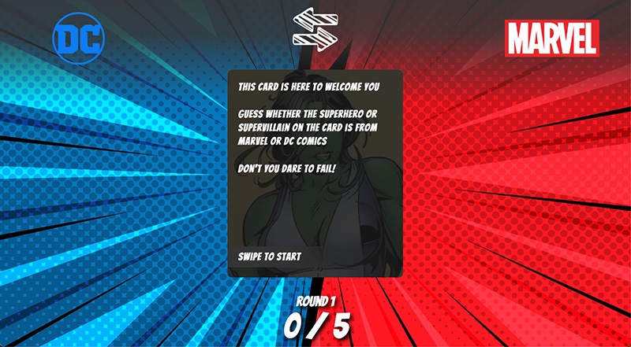
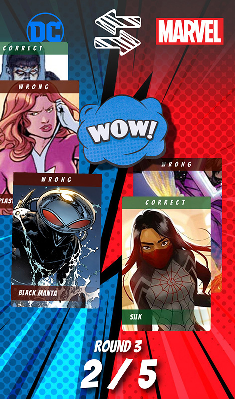

# Marvel vs DC Cards

This is a matching game app built using React. The app displays a set of cards, each featuring a superhero or supervillain from either DC or Marvel comics. The user's task is to match characters from the same publisher by swiping left or right on the cards.

[Play Demo](https://mbukh-comics-match-game.netlify.app)

## Getting started

To run the app locally, follow these steps:

1. Clone this repository.
2. Open the project directory in your terminal.
3. Install the required dependencies using the command `npm install`.
4. Start the development server using the command `npm start`.
5. Open the app in your browser at http://localhost:3000.

     

        
     

     

        
     

## How to play

1. Swipe a card to the left to choose DC for a character.
2. Swipe right on a card to select Marvel.
3. Each round consists of five cards.
4. Points are awarded for each correct match.
5. At the end of a round all cards are shown on their correct sides.
6. Press WOW button to proceed to the next round.

## Author

This app was developed by [MBukh.dev](https://mbukh.dev).
